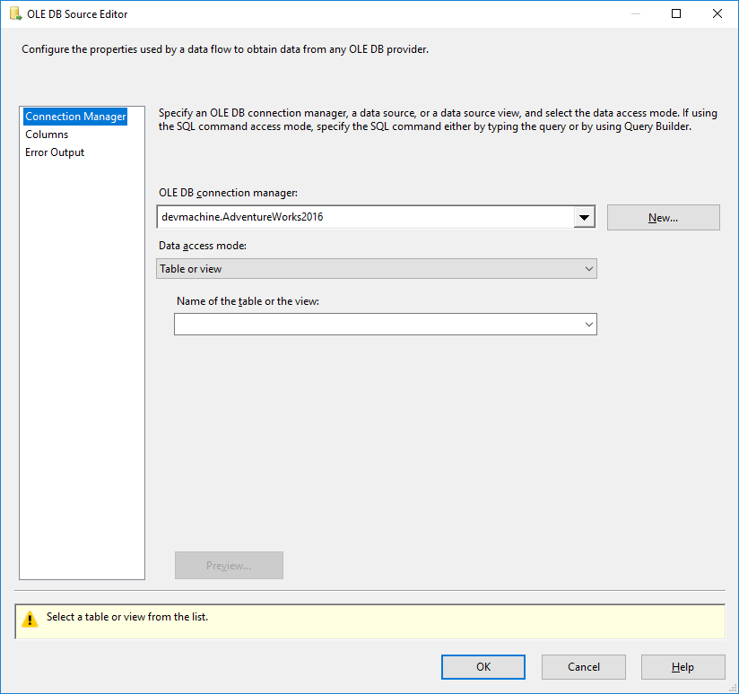
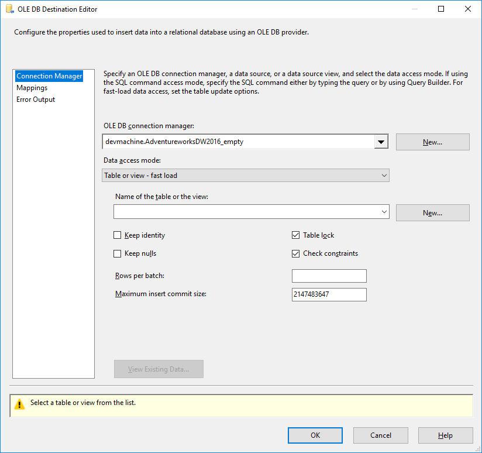

# Lab 01 - Exercise 1

## Description
In this lab, you will create your first SSIS package.

## Steps

### Create a new (empty) SSIS project
1. Open *SQL Server Data Tools* (Visual Studio)
2. Create a *new SSIS project*. Name it *"Lab 01"*.
3. *Delete* the package *"Package.dtsx"* that has been added automatically

### Create a Data Flow Task
4. Add a *new package*, call it *"Load_dimProductCategory.dtsx"*
5. Add a *Data Flow Task*. Rename it to *"DFT load dimProductCategory"*
6. Inside "DFT load dimProductCategory", use the *Source assistant* to create a *new connection manager* with the following settings:

*todo: localhost ipv devmachine?*
* Server name: *devmachine*
* Authentication: *Windows Authentication*
* Database name: *AdventureWorks2016*

7. Click *"Test Connection"* to verify that the connection settings you just entered are valid

A new component has been added for you to the data flow canvas, labeled *"OLE DB Source"*.
Currently, it shows a red cross, because the settings are invalid.

In order to fix this problem, we need to point the source towards a specific table or view inside the AdventureWorks2016 database.

8. Open the *OLE DB Source* component that was just added to the dataflow. A window opens, similar to the one shown below .
9. Select the table *[Production].[ProductCategory]*
10. Click on *"Columns"*. This opens another page of the Source component properties, where all columns are shown.
11. Click *"OK"* to close the window.

Now, the red cross disappears.

12. Rename de OLE DB Source component to "OLE_SRC Production ProductCategory" 

13. Use the *Destionation Assistant* to create a *new connection manager* with the following settings:

* Server name: *devmachine*
* Authentication: *Windows Authentication*
* Database name: *AdventureWorksDW2016_Empty*

14. Click "Test Connection" to verify that the connection settings you just entered are valid

A new component has been added for you to the data flow canvas, labeled "OLE DB Destination".
Again, it shows a red cross, because the settings are invalid.

Two things need to be done in order to get the settings right:
a. Provide an input (it's a destination after all)
b. Provide details which table to use inside the database (the connection manager points to the database, but not specifically towards a table)

15. In order to provide an input to the destination, *drag* the output from *"OLE_SRC Production ProductCategory"* towards *"OLE DB Destination"*. A blue arrow appears, pointing from "OLE_SRC Production ProductCategory" towards "OLE DB Destination".

16. To enter the necessary details for the destination, open *"OLE DB Destination"*.
A popup window opens, similar to the one shown below 
Notice the exclamation mark on the bottom of the popup. It reads "Select a table or view from the list." 

17. Open the *dropdown* under the text "Name of the table or the view:" and *select "[dbo].[DimProductCategory]"*

Notice the exclamation mark on the bottom on the window. Now it reads "Map the columns on the Mappings page."

18. Open the Mappings page, mapping the columns as follows:

* ProductCategoryID -> ProductCategoryAlternateKey
* Name -> EnglishProductCategoryName

19. Click "OK"  to close the window
20. Rename "OLE DB Destination" to "OLE_DST DimProductCategory"
21. Save the package.

### Check if the package works as expected
To check if the package works as expected, perform the following steps:

22. Open SQL Server Management Studio
*todo: localhost ipv devmachine?*
23. Connect to devmachine
24. Execute the following query:

```SQL
SELECT * FROM AdventureworksDW2016_empty.dbo.DimProductCategory
```

An empty table should be returned.
25. Switch to Visual Studio, and execute your just-created package. 

In order to do this, right-click on the package inside the Solution Explorer, and click "Execute Package"

26. Return to SSMS, and re-run the query. You should now have four rows.

### Questions
*todo: kijken of de kolommen wel echt leeg zijn*
- Which columns are empty in DimProductCategory? Why?
- What would happen if we ran this package for a second time?