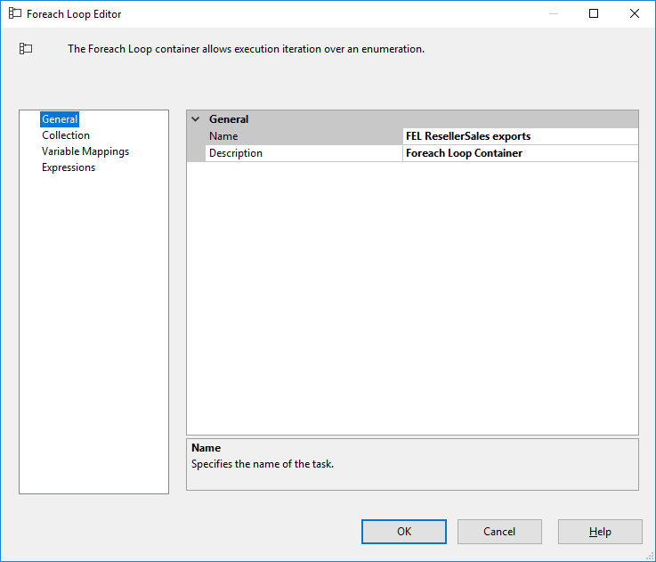
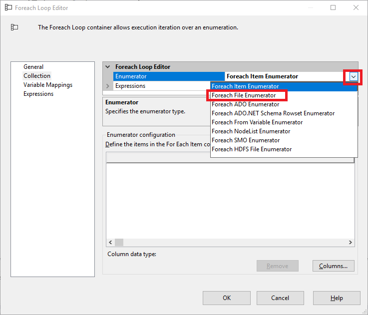
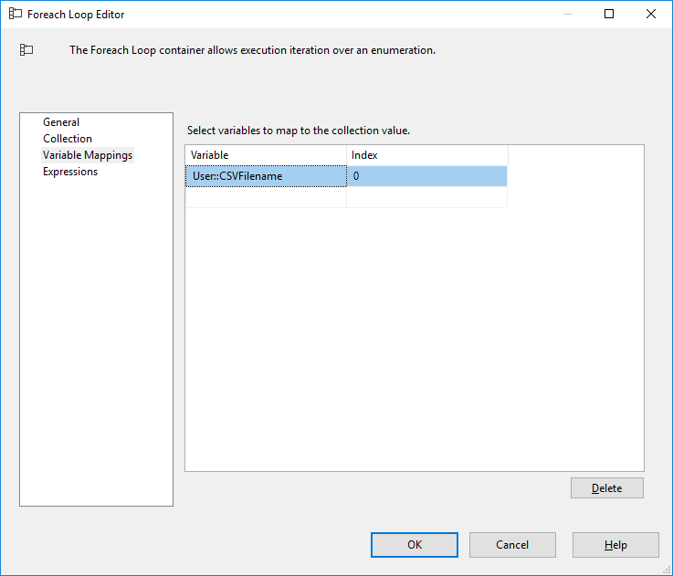

# Lab 5 - Exercise 1

## Description
In addition to the data available in the database, our customer has some CSV files containing reseller sales data of 2014.
In the previous lab, we created an ETL flow to load this data from a particular file
In this lab, we will extend the ETL package so it will load all files the customer uploads to our folder

## Steps

### Getting ready
1. Open "Lab 05 start.sln" from the "start" folder, or continue where you left off after finishing lab 04.
2. Open package "Load Fact Reseller Sales.dtx"
3. Switch to the parameters tab
4. Replace the value of `C:\course\lab04\exports\` with `C:\course\lab05\exports\`
5. Verify everything still runs

If you're into testing, you might also try what happens if a CSV file you refer to is missing.

### Setting up the ForEach loop
6. Switch back to the Control Flow tab
7. Add a new Foreach Loop Container
8. Rename it to "FEL ResellerSales exports"
9. Open the container properties by double-clicking on the container header bar (the large grey bar with icon, arrow and title)

The Foreach Loop Editor window opens:

10. Switch to the "Collection" page

A Foreach Loop iterates over a collection. Examples of collections are:
  * collection of rows (which we retrieved from a SQL Server query, for example)
  * collection of files (all files inside a particular folder)
In this example we will iterate over all files with extension CSV in the folder stored in the parameter (keep in mind that this folder might change every time the package is called upon).

11. Open the dropdown which reads "Foreach Item Enumerator", and select "Foreach File Enumerator"

Configure the following options:
 * Folder: C:\course\lab05\exports\
 * Files: *.csv
 * Retrieve file name: Name and extension
 * Verify that "Traverse subfolders" is *not* checked

12. Switch to the "Variable Mappings" page
13. Select variable `User::CSVFilename` in the first cell. The index "0" is added automatically.

14. Click "OK" to close the Foreach Loop Editor window

### Reflection (in-between)
15. Take a moment to think about the following questions:
  * What value does variable `User::CSVFilename` have /outside/ FEL ResellerSales exports?
  * What value does it have within FEL ResellerSales exports?

### Re-arrange the Control Flow
16. Remove the precedence constraint between `SQL Truncate Fact ResellerSales` and `DFT Load Reseller Sales from CSV`
17. Drag `DFT Load Reseller Sales from CSV` inside `FEL ResellerSales exports`
18. Add a new precedence constraint between  `SQL Truncate Fact ResellerSales` and `FEL ResellerSales exports`
19. Open menu "Format" -> Auto Layout -> Diagram

## Test
20. Try running the package, review the results in SQL Server Management Studio. 

  * Are all files loaded?
  * Is the total number of rows in the fact table as you expected?

## Bonus
### Bonus 1: Use fully qualified path
In the ForEach Loop editor, you configured to retrieve only the *name and extension* from the file.
Change this to *fully qualified*, and re-run the package.
  * Why does the package fail?

21. Alter the package so that it works using the *fully qualified* path.

### Bonus 2: Configure the Foreach Loop so that it iterates inside the parameterized path
Currently, the Foreach Loop has its path fixed at `C:\course\lab05\exports\`
This is unwanted behaviour: we provide a path inside the package parameter, so the package is expected to iterate over that path - not a possibly different path configured inside the package.

22. Open the Foreach Loop Editor by double-clicking on the container header bar (the large grey bar with icon, arrow and title)
23. Switch to the "Collection" page
24. Try to figure out how to set the Folder property using an expression (where the expression is the parameter value).

